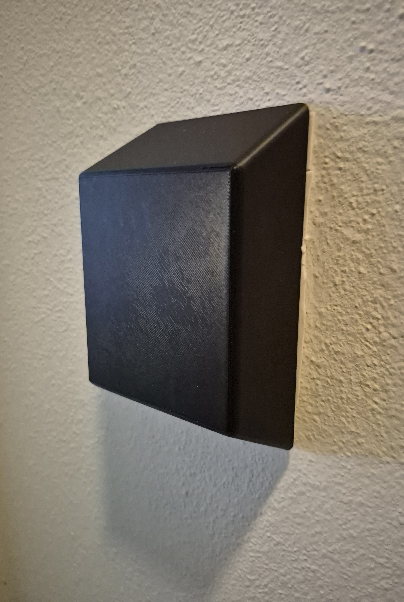
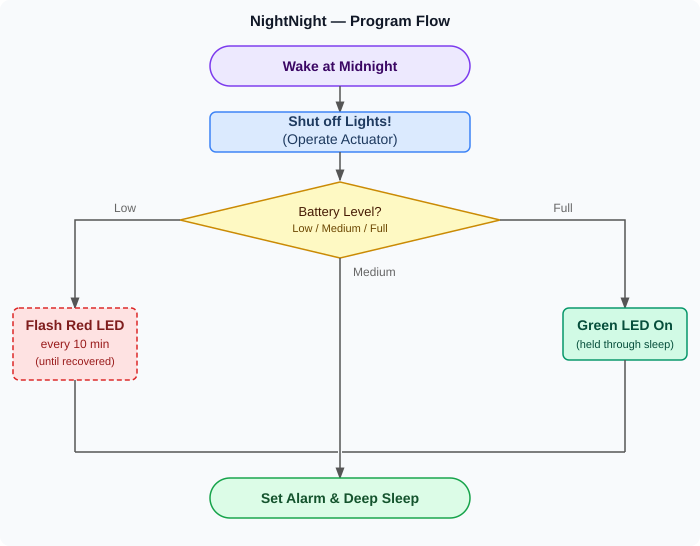

# NightNight
BME 349 Instrumentation Project - Automatic Light Switch System

## Repo Contents
- **NightNightCircuit** — KiCAD circuit schematic for the NightNight module
- **nightNightMain** — firmware running on the XIAO ESP32-C3
- **testSuite** — test scripts for different components of the module
- **flowchart.svg** — detailed system flow diagram

Simplified Module Flow Diagram

